<!-- Generated by GitHub Profile Agent Console. Edit profile.config.json, then run npm run generate. -->

  <picture>
    <source media="(max-width: 760px) and (prefers-color-scheme: dark)" srcset="./assets/hero/agent-console-fb605f0b-mobile-dark.svg">
    <source media="(max-width: 760px)" srcset="./assets/hero/agent-console-fb605f0b-mobile-light.svg">
    <source media="(prefers-color-scheme: dark)" srcset="./assets/hero/agent-console-fb605f0b-dark.svg">
    <source media="(prefers-color-scheme: light)" srcset="./assets/hero/agent-console-fb605f0b-light.svg">
    
  </picture>

  
  
  

## About Me

Full-Stack Developer dan UI/UX enthusiast dari Indonesia, fokus membangun aplikasi web yang handal dengan Laravel dan CodeIgniter, serta aplikasi mobile interaktif menggunakan Flutter.

Menggabungkan logika kode dengan estetika desain — dari backend PHP hingga tampilan UI yang rapi dan mudah digunakan.

## Current Focus

| Area | What I am exploring |
| --- | --- |
| **Web Development** | Membangun aplikasi web dengan Laravel dan CodeIgniter, didukung MySQL. |
| **Mobile Development** | Membangun aplikasi mobile lintas platform dengan Flutter dan Dart. |
| **UI/UX Design** | Merancang antarmuka dan branding menggunakan Figma dan Photoshop. |

## Featured Work

| Project | Focus | Why it matters |
| --- | --- | --- |
| [**Ganti Nama Proyek**](https://github.com/AidilNasir/GANTI-DENGAN-REPO-ASLI) | Ganti dengan fokus proyek | Ganti dengan ringkasan singkat proyek unggulan pertama kamu (10-220 karakter). |
| [**Ganti Nama Proyek**](https://github.com/AidilNasir/GANTI-DENGAN-REPO-ASLI-2) | Ganti dengan fokus proyek | Ganti dengan ringkasan singkat proyek unggulan kedua kamu (10-220 karakter). |

## Research Direction

Fokus membangun produk web dan mobile secara menyeluruh: backend PHP yang solid dengan Laravel dan CodeIgniter, aplikasi mobile lintas platform dengan Flutter, dan tampilan antarmuka yang dirancang dengan prinsip UI/UX yang baik.

## Tech Stack

`PHP` · `Laravel` · `CodeIgniter` · `Flutter` · `Dart` · `MySQL` · `Firebase` · `JavaScript` · `HTML5` · `CSS3` · `Git` · `Figma`

## Recent Activity

<!-- AUTO:ACTIVITY:START -->
_Recent public activity will appear here after the workflow runs._
<!-- AUTO:ACTIVITY:END -->

---

  Menggabungkan logika kode dengan estetika desain.

